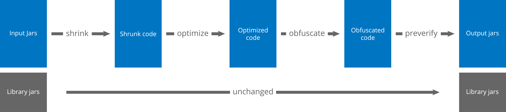

## ProGuard

Java 클래스 축소기, 최적화기, 난독화기, 사전검증기

shrinking step
- 사용하지 않는 클래스, 메소드, 필드, 어트리뷰트를 감지하고 삭제

optimization step
- 메소드의 바이트 코드를 분석하고 최적화

obfuscation step
- 남아 있는 클래스, 메소드, 필드의 이름들을 의미 없는 짧은 이름으로 변경

preverification step
- Java ME에 필요하거나, Java 6 이상에서 시동 시간을 향상 시키는 사전확인 정보를 추가

---

shrinking, optimization, obfuscation step 은 코드를 작게, 더 효율적이게, 리버스엔지니어링이 힘들게 한다.

#### -keep 옵션

reflection 등은 ProGuard의 영향으로 올바른 결과를 내지 않을 수 있다.

이럴 때 `-keep` 옵션을 통해 수동으로 코드를 보호할 수 있다.

#### Reference

https://stuff.mit.edu/afs/sipb/project/android/sdk/android-sdk-linux/tools/proguard/docs/index.html#manual/introduction.html

https://www.guardsquare.com/en/proguard/manual/introduction
