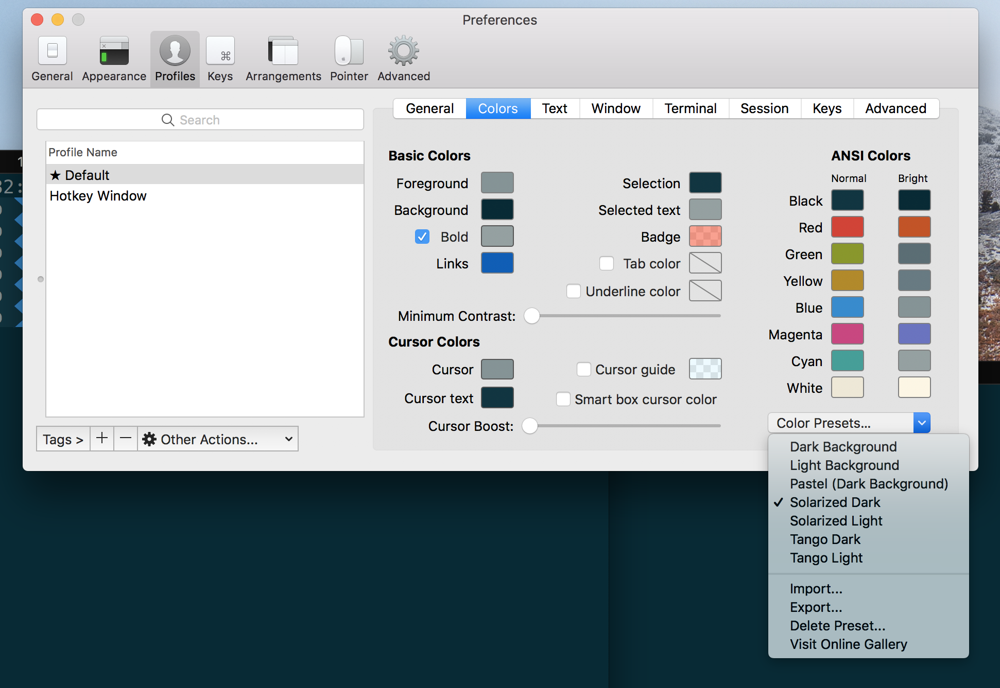
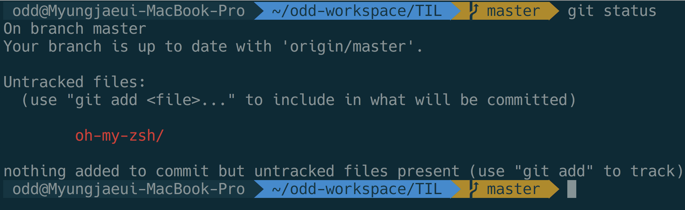
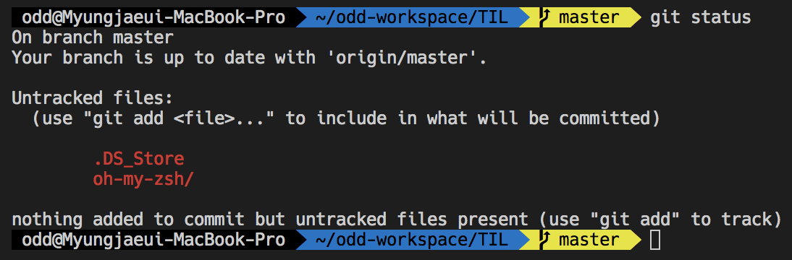
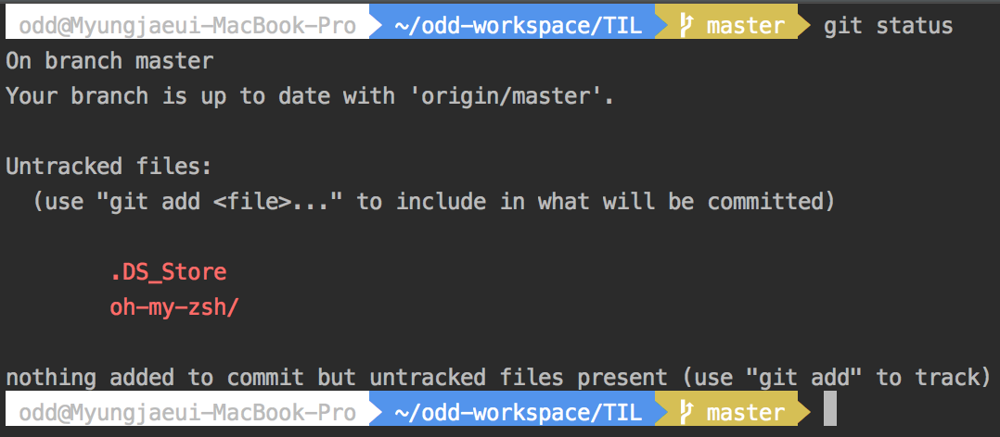

## Oh My Zsh 설정 (macOS)

1. git 설치

2. Oh My Zsh 설치
```sh
sh -c "$(curl -fsSL https://raw.githubusercontent.com/robbyrussell/oh-my-zsh/master/tools/install.sh)"
```

3. 테마변경 - `~/.zshrc` 파일 변경
```
ZSH_THEME="agnoster"
```

4. powerline fonts 설치

```sh
# clone
git clone https://github.com/powerline/fonts.git --depth=1
# install
cd fonts
./install.sh
# clean-up a bit
cd ..
rm -rf fonts
```

5. terminal에 powerline font 설정

#### 적용 결과

- iTerm2 (color scheme 적용 필요)

scheme setting

result


- VSCode



- IntelliJ



#### Reference

https://github.com/robbyrussell/oh-my-zsh
